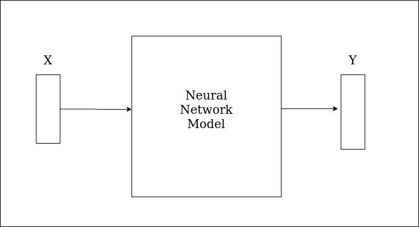
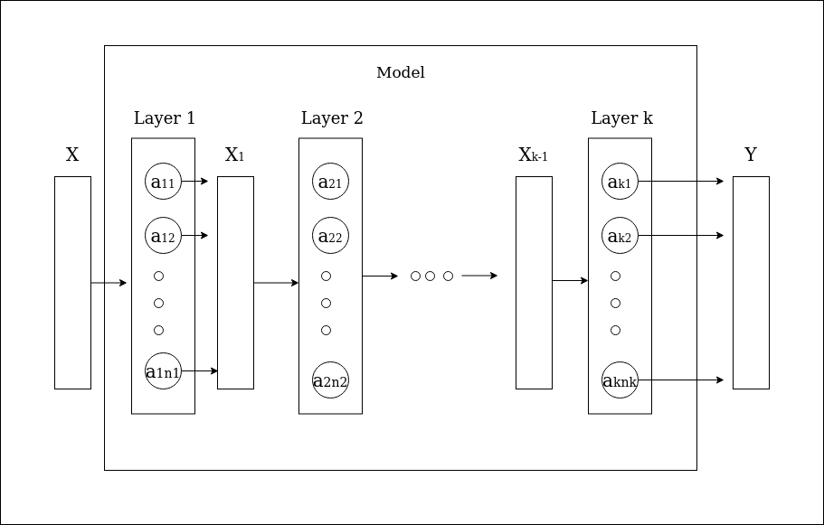
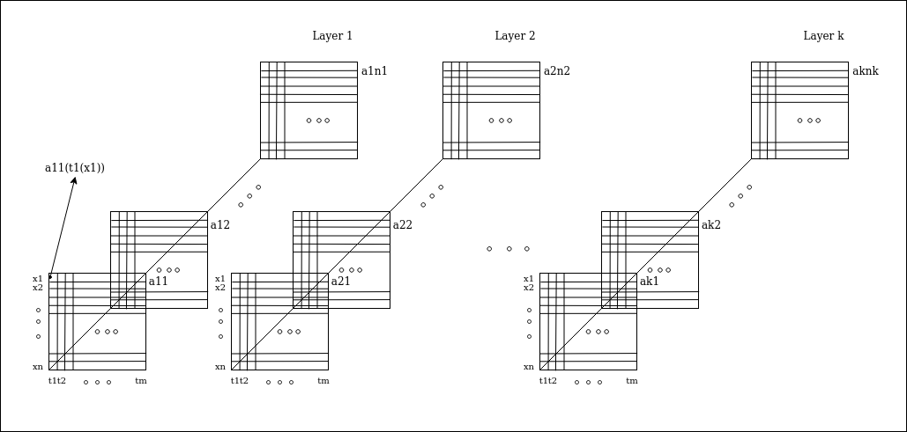
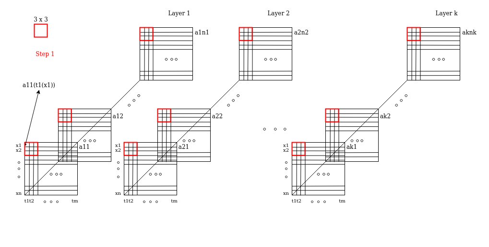
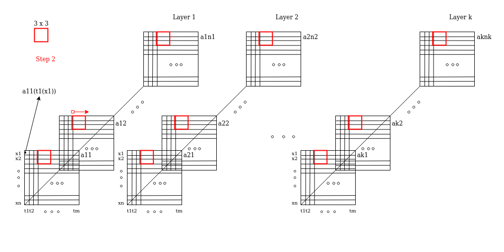
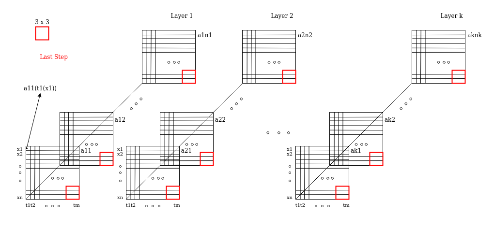

# Metrics on Neural Network Models in TF 2

In this library, there are a set of python classes, developed in tensor flow 2,designed to be used in the calculus of different metrics on neural network models.  
Besides, there are two metrics developed. These metrics are known as Invariance and Same Equivariance.

### Main Classes

1. Model
2. DataSet
3. Iterator

### Others Classes

1. MnistDataSet

### Metrics Classes

1. Variance
2. Same Equivariance

 
 

## Class Model

### Introduction

Let's supose we have a neural network model, as in the figure 1:

In detail, a neural network model is conformed by a series of layers as we can see in the figure 2:

where every layer has a set of activations that we call $aij$ being i the layer index and j the activation index.

Now, let's suposse we are interested in knowing the value of each activation when our model predict an input X. To get these values it is necessary a model that has as outputs not only the output Y but also the activations $aij$.
One of the main features of the class Model is what we have mentioned before, that is to say, our class Model allows us getting the activations values corresponding to the prediction of any input X. This class takes a Keras Model and creates a new model having as outputs the activations for each layer in the Keras Model.
 
 
Another feature of the Class Model is that its method predict takes as argument a matrix of inputs. It was thougth to deal with metrics that works with samples and transformations, but it is also possible to forget the input meaning and just think of a 2D input.

### Usage

<pre>

<code>
model_keras = ...  #instance of a Keras Model
model = Model(model_keras=model_keras)
input = ... # tensor of rank n>2
output = model.predict(input)
i=...
j=...
l=...
print("Activations values for input[i][j] in the layer l " + output[(i,j,l)])
#Another way of instantiating the class is the next
path = ".../mymodel.h5" #path to the file .h5
model = Model(path=path)

</code>
</pre>

### Methods

- predict
- size_layers
- size_activations
- size_activations_layers

 

#### Method: predict

**Arguments**

- tensor_input: a tensor of rank n, n > 2, where the first two dimentions represent the matrix and the rest dimentions represent the input data.
   

**Returns**

Returns an object that indexes a three dimensional list through a tuple (i,j,l) where i represents the row and j represents the column corresponding to the input matrix and l represents the l-layer of a model. The values in the list are the activations values in the layer l for the input located in the row i and the column j.

#### Method: size_layers

Returns the amount of layers in the model.

#### Method: size_activations

Returns the amount of activations in the model.

#### Method: size_activations_layers

Returns a list with the amount of activations in each layer of the model.

## Class DataSet

DataSet is an abstract class designed to represent a 2D dataset which will be used by the Iterator to iterate over the model. The implementations of the DataSet are responsability of the user and they are necessary to use the Iterator. An implementation available in this library is the MnistDataSet.

### Methods

- get_data_shape
- get_width
- get_height
- get_matrix
- transpose

#### Method: get_data_shape

Returns the shape of the data in the matrix.

#### Method: get_width

Returns the matrix width.

#### Method: get_height

Returns the matrix height.

#### Method: get_matrix

**Arguments**

- rows: a list of indices
- columns: a list of indices
   

**Returns**

Returns a submatrix conformed by the rows and columns passed as arguments.

#### Method: transpose

Transpose the DataSet.

## Class Iterator

### Introduction

Let's consider we have a 2D dataset, for example a dataset of samples and transformations, and we want to get every value predicted by the model for each input in the dataset. If we think of all possible values that we will obtain and besides we divide these values into layers, it is possible to imagine some kind of data representation in the way showing in the next figure:

Every square represents a matrix with the values of an activation for each input in the dataset. For instance, the first square represents the activation $a11$ and has the values $a11(ti(xj))$ with $i\ \varepsilon \ \{1,...,m\}$ and $j\ \varepsilon \ \{1,...,n\}$ where $a11(ti(xj))$ is the value of the activation $a11$ predicted by the model for the input $ti(xj)$.

 
 

Now that we have a visual representation of the values we are looking for, it is easier to understand what the Iterator Class does. The Iterator gives you the possibility of moving and getting the values through blocks of width and height defined by yourself.  
For example, let's consider a block of 3x3. The iterator allows you obtaining the data in the following way:

### Usage

<pre>
<code>
model = Model(...)
dataset = DataSet(...)
iterator = Iterator(model, dataset)
height = 3
width = 3
for height, blocks in iterator.get_block(height, width):
    #...
    for width, block in blocks
        #...    

</code>
</pre>

#### Look at the Variance Class to have another using example!

### Constructor

**Arguments**

- model: an instance of the Model class
- dataset: an instance of the DataSet class

 

### Methods

- get_block
- get_model

#### Method: get_block

**Arguments**

- height: the height of the block
- width: the width of the block
 

**Returns**

Returns a "vertical" iterator where each item in this iterator is a tuple (height,blocks_iterator) where blocks_iterator is an "horizontal" iterator in which each item is a tuple (width,block_activations) where block_activations is an object that indexes a three dimensional list through a tuple (i,j,l) where i represents the row and j represents the column corresponding to the block and l represents the l-layer of a model. The values in the list are the activations values in the layer l for the input located in the row i and the column j, and width is the width of the block and the height of the block is the height returned previously.  

***Remark***

When we say "vertical" iterator, we refer to the movement of the iterator in the block, the same happens with we say "horizontal" iterator.  

#### Method: get_model

Returns the model in the iterator. 